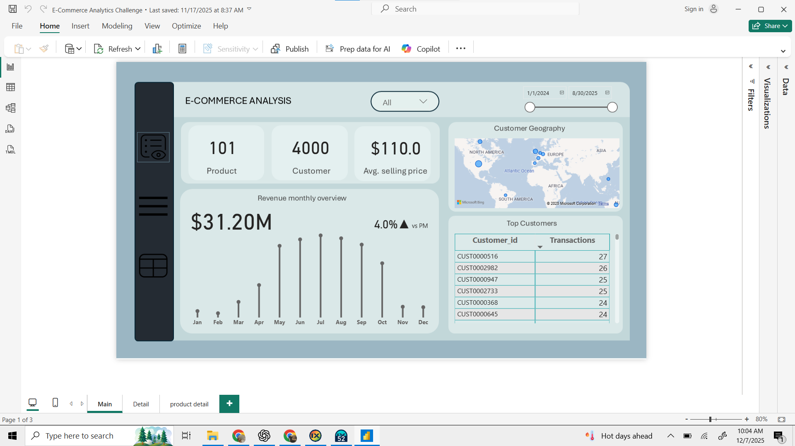
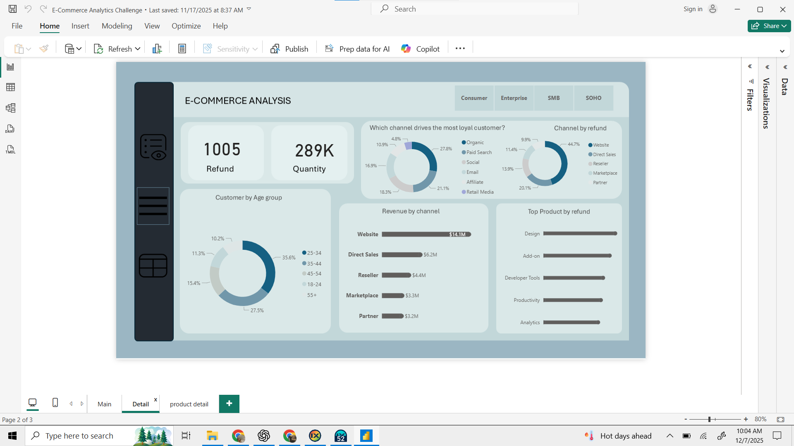
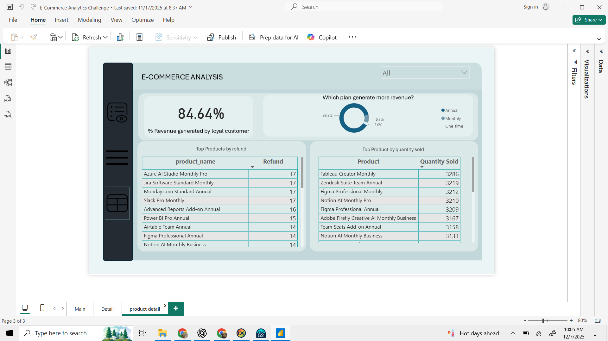

# E-Commerce Sales Analysis

## Table of contents

- [Project Overview](#project-overview)
- [Data Sources](#data-sources)
- [Recommendations](#recommendations)

### Project Overview 
---

This data analysis project aims to provide insight into exploring loyal customers, sales trends, channels that drive repeated purchases, and product performance.

### Data Sources 
---

The dataset used for this project was provided by Onyx DataDNA for the Data challenge of the month of November 2025 containinf detailed information of the events, customers and products.

### Tools
--- 

- Power Query - Data Cleaning and Transformation.
- Power Bi - Data Analysis and creating  reports.

### Data Cleaning/Preparation
--- 

 1. Handling missing values.
 2. Data cleaning and formatting.
 3. creating a new custom condition column for visualization.

### Exploratory Data Analyis
---

 EDA involved in exploring the sales data to answer key questions, such as:
- Identifying Loyal Customers (repeated buuyers) and channels that drives them?
- where are our customers based and their age group distribution?
- which products are most refunded and most frequently ordered?

### Results/Findings
---
The analysis results are summarized as follows:

1. The loyal customers takes up 84.64% of the total revenue genrated by the company.
2. Website channel generates the most revenue in comparison with the other event channel.
3. Most of the customers are within the age group of 25-34.
4. Highest sales were made in the months of June, July and August.

### Recommendations
---
Based on the analysis we recommend the following actions:

1. Invest more in paid search, email and social acquisition channel to drive more loyal customers which automatically guarrantees for repeated purchases.
2. Focus more on expanding and promoting the direct sales and reseller sales channel to drive in more revenue.\

### Dashboard Screenshots

